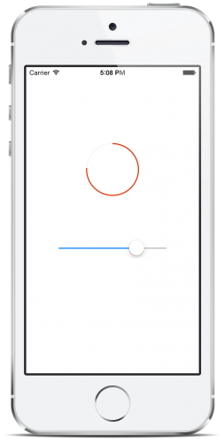

# LSKRoundedProgressView

Minimal (truly minimal :) rounded progress indicator, which is a clipped version of [KAProgressLabel](https://github.com/kirualex/KAProgressLabel).

## Install
### Source Code
Copy the `LSKRoundedProgressView/LSKRoundedProgressView.{h, m}` to your project.

### CocoaPods

    pod 'LSKRoundedProgressView'

Don’t forget to `#import "LSKRoundedProgressView.h"`

## Usage
It behaves like a normal `UIView`.
You set the progress value (a `CGFloat` value, range from 0.0 to 1.0) by operating the following property:

    @property (nonatomic, assign) CGFloat progress;

## Custom 

    @property (nonatomic, assign) BOOL clockWise;
    @property (nonatomic, assign) CGFloat progressWidth;
    @property (nonatomic, copy) UIColor *trackColor;
    @property (nonatomic, copy) UIColor *progressColor;

## Licence
MIT
